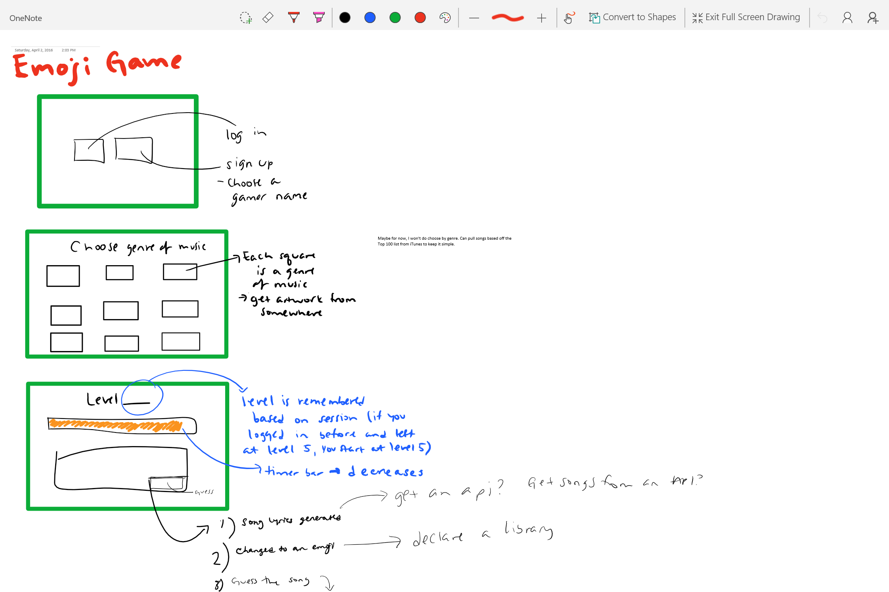
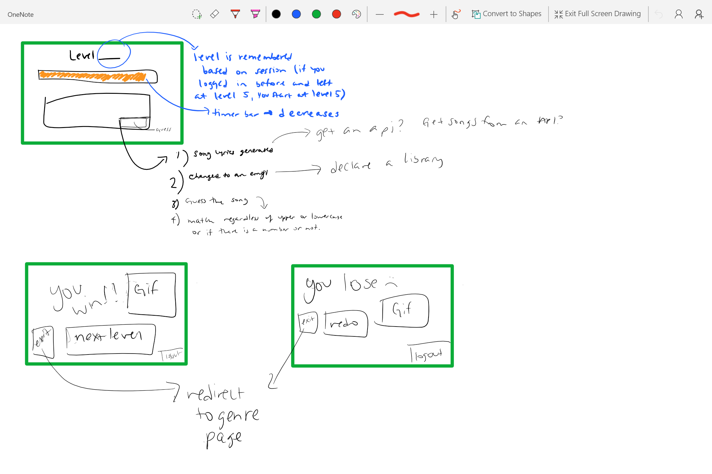

# The Emoji Game

## Overview

The emoji game is a web app game that picks a song from the iTunes 100 list, and depending on which level you are on, it switches out certain lyrics of the song with emojis. You have 15 seconds to guess which song it is. Players can register and log in and the app will keep track of which level you are on. Before proceeding to the next level, the player can indicate if they liked the song, disliked the song, or have no preference of the song.

##Wireframes




## Data Model

(Describe the documents that you'll be storing - assuming that you're using a document based NoSQL database, like mongoose ... this can be in the form of commented plain JavaScript objects or an _actual_ Mongoose schema)

Minimally, we'll have to store songs the user liked, which level the player is on, and the score per level.

* users can have multiple lists
* each list can have multiple items

First draft schema:

```javascript
// users
// * our site requires authentication...
// * so users have a username and password
// * they also can have 0 or more lists
var User = new mongoose.Schema({
  // username, password provided by plugin
  lists:  [{ type: mongoose.Schema.Types.ObjectId, ref: 'List' }]
});

// an item (or group of the same items) for song preference
// * includes the whether or not the user liked the song)
// * items in a list can be crossed off
var SongPref = new mongoose.Schema({
	name: {type: String, required: true},
	preference: {type: String},
}, {
	_id: true
});


## Research Topics
I will need to find a library that gets emojis from, and provide an emoji translation. AKA ":)" means not only smiley face, but smile, smiling, etc. Worst comes to worst, I will just hardcode an emoji JSON file to retrieve this data if I can't find one. --> the Slack API looks like a good one: https://api.slack.com/methods/emoji.list


* (3 points) Integrate user authentication
    * I'm going to be using passport for user authentication
    * see <code>cs.nyu.edu/~jversoza/ait-final/register</code> for register page
    * see <code>cs.nyu.edu/~jversoza/ait-final/login</code> for login page
* (2 points) Perform client side form validation using a JavaScript library
    * see <code>cs.nyu.edu/~jversoza/ait-final/my-form</code>
    * if you put in a number that's greater than 5, an error message will appear in the document object model

* (2 points) use d3.js library for visualization purpuses
    * the library provides several visualization libraries and tools
    * you can see it working in these pages:
        * sanjplusplus.me/whereInTheWorld
        * http://www.nytimes.com/interactive/2012/11/30/us/tax-burden.html?_r=0

* (2 points) iTunes library API
    * I want to use various APIs to get the song's album artwork, the song itself, and get a list of the current trending top 100 songs
* (2 points) metroLyrics API
    * Get the lyrics of the song

Used forEach twice
